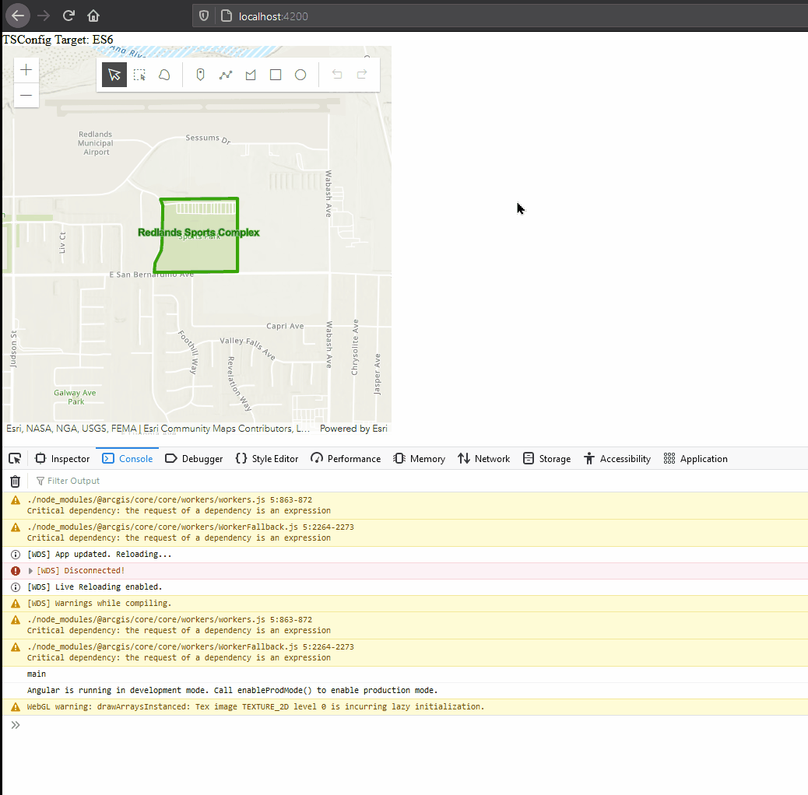
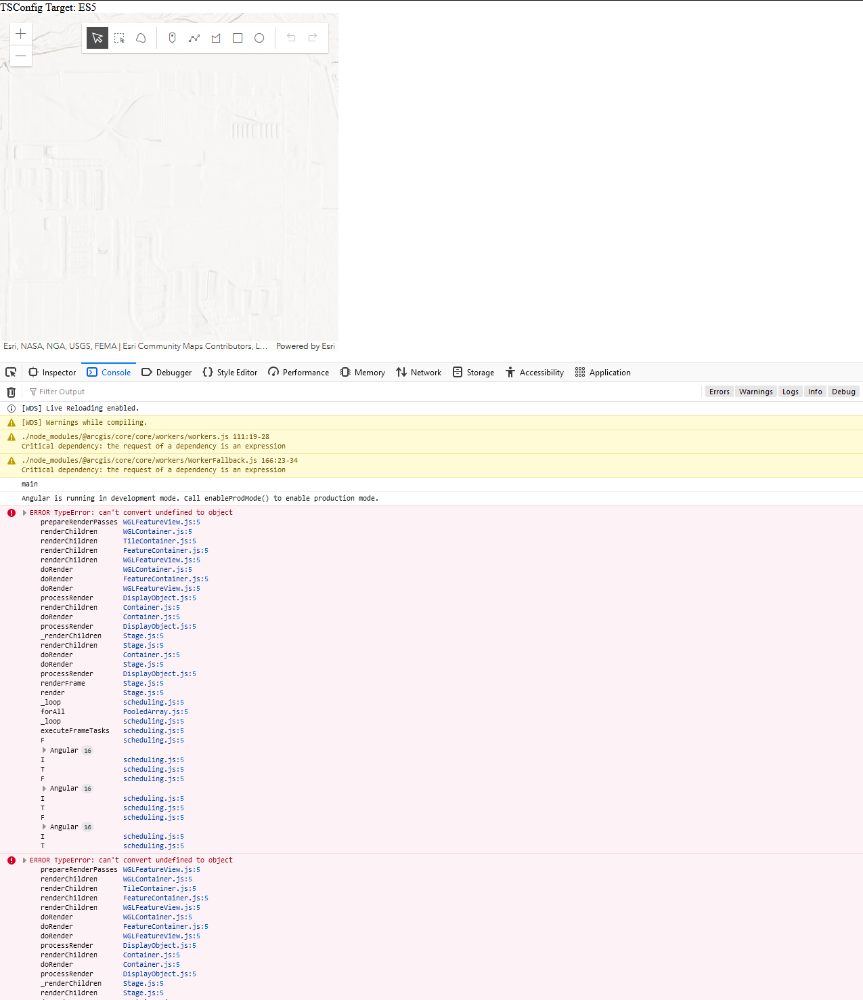

# ArcGIS JSAPI Integration with Angular

# Issue
Target on tsconfig.json weird results. See following screenshots for es6.

# ES6/ES2015
Drawing does not appear until I zoom in/out, second time it shows up correctly. This is the same for custom draw as well as other drawing tools (Point, line, Polygon)

# ES5
ES5 fails to load MapImageLayer and webmap. If I remove those layers drawing works just fine but with those layers, app fails to load.

